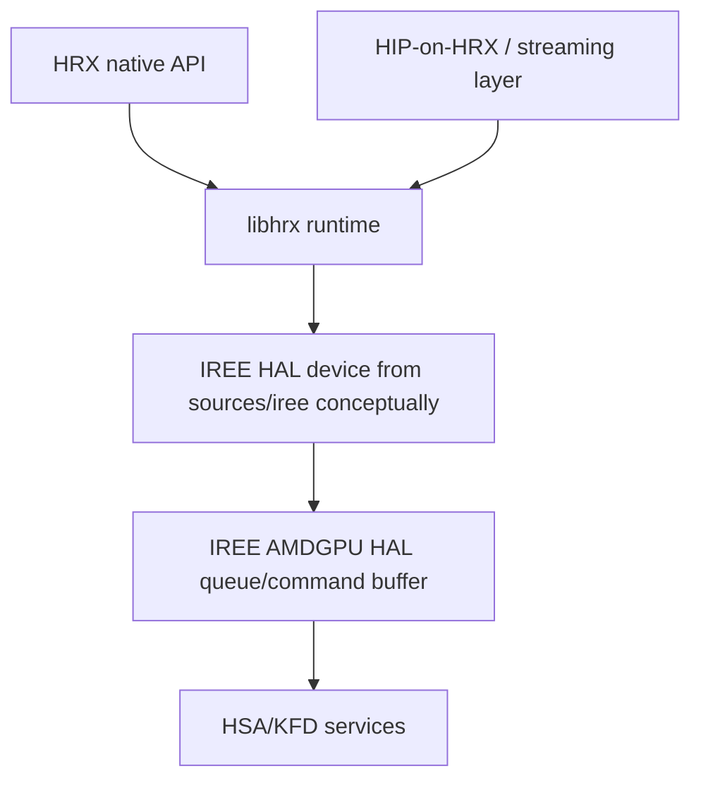

# HRX Dossier

Status: first-pass topology and research scaffold.

## Role

HRX is the primary replacement candidate for CLR and low-level runtime/profiling
services. It exposes an explicit native C API over device, allocator, buffer,
timeline semaphore, stream, queue operation, executable, and VM module concepts.
It also contains HIP-on-HRX and streaming compatibility layers.

Important source rule: use `sources/hrx` for HRX behavior, API, CTS, and
compatibility-layer analysis. Use `sources/iree` for authoritative IREE HAL
analysis. HRX's vendored IREE copy is an import point, not the source of truth
for current HAL analysis.

Evidence:

- `Source-grounded`: HRX public headers live in `sources/hrx/include`.
- `Source-grounded`: HRX native runtime lives in `sources/hrx/src/libhrx`.
- `Source-grounded`: HIP/streaming compatibility layers live under
  `sources/hrx/src/streaming` and HRX HIP binding paths in the HRX checkout.

## Key Source Areas

- Public API:
  - `include/hrx_runtime.h`
  - `include/hrx_runtime_cxx.h`
  - `include/hrx_compiler.h`
  - `include/hrx_compiler_cxx.h`
- Native runtime:
  - `src/libhrx/runtime.c`
  - `src/libhrx/device.c`
  - `src/libhrx/allocator.c`
  - `src/libhrx/buffer.c`
  - `src/libhrx/semaphore.c`
  - `src/libhrx/fence.c`
  - `src/libhrx/stream.c`
  - `src/libhrx/queue_ops.c`
  - `src/libhrx/executable.c`
  - `src/libhrx/module.c`
  - `src/libhrx/transfer.c`
- HIP compatibility and streaming:
  - `src/streaming/stream.c`
  - `src/streaming/event.c`
  - `src/streaming/memory.c`
  - `src/streaming/module.c`
  - `src/streaming/graph.c`
  - `src/streaming/graph_exec.c`
  - `src/streaming/graph_analysis.c`
  - `src/streaming/device.c`
  - `src/passthrough`
- CTS:
  - `cts`

## Request Flow

HRX streams own timeline semantics at the HRX layer and record/submit work via
HAL-like command buffers and queue operations. Direct queue ops are available
for immediate-mode compatibility.

## SOL-Relevant Observations

- `Source-grounded`: HRX exposes explicit buffers, timeline semaphores,
  executables, queue operations, streams, and VM modules in its public API.
- `Source-grounded`: HRX supports `HRX_PROFILE_FILE` and `HRX_PROFILE_MODE`
  environment controls that feed IREE-style profiling output.
- `Source-grounded`: HRX CMake exposes sanitizer options such as ASAN, MSAN,
  TSAN, and UBSAN.
- `Measured`: existing llama.cpp HRX reports show HRX can reach or beat native
  HIP stream-mode submission in selected decode/prefill tests, while naive HIP
  graph mode was slower. See `docs/spike/reports/native-hip-vs-hrx.md`.
- `Measured`: the MI300X serving report linked from the root README reports
  broad HAL wins over direct HIP stream/event orchestration on
  orchestration-heavy serving-shaped schedules. Treat this as a strong working
  premise while keeping product-level numeric claims in evidence docs.
- `Owner assertion`: the current HRX compatibility surface began as a rapid
  PyTorch-oriented backend spike over IREE and was then coarsely lifted into a
  broader runtime/compatibility layer. Treat current rough edges as
  productization debt unless source evidence shows they are architectural limits.
- `Open question`: distinguish HRX's current overhead from IREE AMDGPU HAL
  overhead by tracing the exact HRX-to-IREE calls against `sources/iree`.
- `Open question`: determine which HIP compatibility features remain incomplete
  and which are irrelevant for a native HRX path.

## Testing And Code Health

- `Source-grounded`: HRX CTS covers lifecycle, status, device, allocator,
  memory, transfer, semaphore, stream, stream ops, refcount, VM/fence, and
  virtual memory.
- `Plan requirement`: HRX readiness must be judged against the union of HRX CTS,
  IREE HAL CTS, and existing HIP tests. HRX-specific CTS alone is not the
  compatibility bar.
- `Source-grounded`: CTS docs call out gaps around queue/stream dispatch,
  executable load/export/global lookup, stream barrier, multithreading,
  multidevice, and fork safety.
- `Inference`: HRX is far smaller and more legible than CLR, but less mature and
  less compatibility-proven.
- `Open question`: add fuzzing/security analysis for HRX API inputs, executable
  loading, HIP compatibility parsing, and environment controls.
- `Open question`: evaluate unit-testability of HRX and HIP-on-HRX at queue,
  packet, graph, loader, and profiler translation boundaries, not just CTS pass
  rate.

## Graph And Multi-Device Readiness

- `Source-grounded`: HRX has native command/queue/executable concepts that map
  naturally onto an explicit graph runtime.
- `Inference`: HRX is better positioned than HIP streams as a frontend for
  consolidated graph submission, and current benchmark evidence supports that
  direction for dynamic serving-shaped DAGs. Product readiness still depends on
  HIP-test coverage, profiler integration, and hardening.
- `Owner assertion`: prior executive research records branch assertions about
  HRX/IREE record/replay, remoting, and AMDGPU graph-offload paths. Keep these
  separated from landed-code claims until validated.
