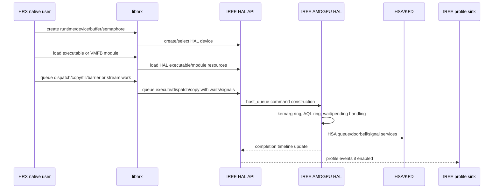
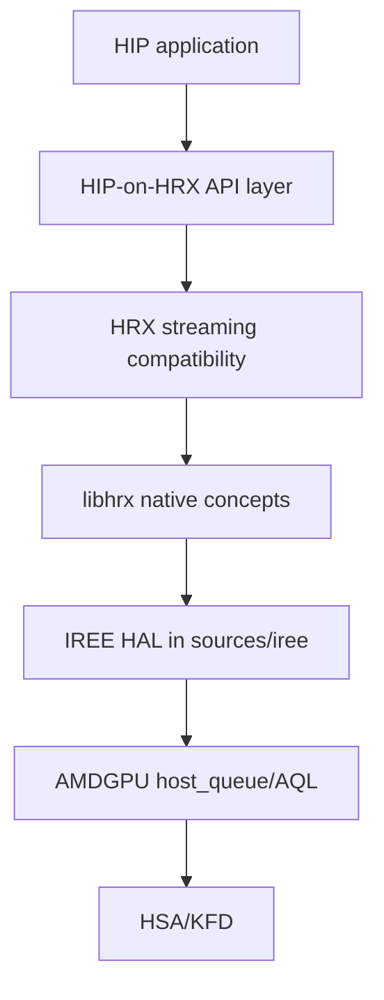

# HRX To IREE Submission And Profiling Flow

Status: first-pass flow map.

## Source Authority

Use `sources/hrx` for HRX API and compatibility behavior. Use `sources/iree` for
IREE HAL behavior. HRX's vendored IREE runtime snapshot is an import point, not
the source of truth for current IREE AMDGPU HAL design.

## Scope

This flow maps how HRX native APIs and HIP-on-HRX concepts should be correlated
to the current IREE HAL AMDGPU runtime in `sources/iree`. It is the starting
point for evaluating HRX as a runtime backplane.

## Native HRX Flow

## HIP-On-HRX Flow

## Correlation Checklist

For each HRX call path, record the current `sources/iree` equivalent:

| HRX concept | IREE HAL concept to correlate |
| --- | --- |
| `hrx_runtime_t` | driver registry, HAL device creation, VM/proactor state |
| `hrx_device_t` | `iree_hal_device_t`, AMDGPU logical device |
| `hrx_buffer_t` | `iree_hal_buffer_t`, allocator/import paths |
| timeline semaphore | `iree_hal_semaphore_t`, AMDGPU semaphore and async timeline |
| stream | command buffer batching plus queue wait/signal lists |
| queue dispatch/copy/fill | `iree_hal_device_queue_*` APIs and AMDGPU host_queue ops |
| executable | `iree_hal_executable_t`, AMDGPU executable loader/cache |
| VMFB module | IREE VM bytecode module plus HAL module |
| profile file/mode | HAL profile options, AMDGPU profile event/metadata/traces |

## SOL Questions

- Does HRX add unavoidable overhead above direct IREE HAL queue APIs?
- Which HRX stream semantics are compatibility-only and which are native runtime
  primitives?
- Where can IREE AMDGPU HAL elide waits and collapse multiple small operations?
- Is profiling emitted from the same queue owner that submits packets?
- What gaps exist across the full HRX readiness suite: HRX CTS, IREE HAL CTS,
  and HIP tests?
- Which HRX-to-IREE calls require an IREE import/update or intentional fork
  decision?

## Required Follow-Up

- Trace one native HRX dispatch into current `sources/iree` APIs.
- Trace one HIP-on-HRX kernel launch into current `sources/iree` APIs.
- Compare HRX `.ireeprof`, IREE HAL profile events, and rocprofiler-sdk output
  for the same workload.
- Measure direct IREE HAL dispatch overhead versus HRX native dispatch overhead
  and HIP-on-HRX dispatch overhead.
- Run or map the corresponding HRX CTS, IREE HAL CTS, and HIP-test coverage for
  the exercised paths.
